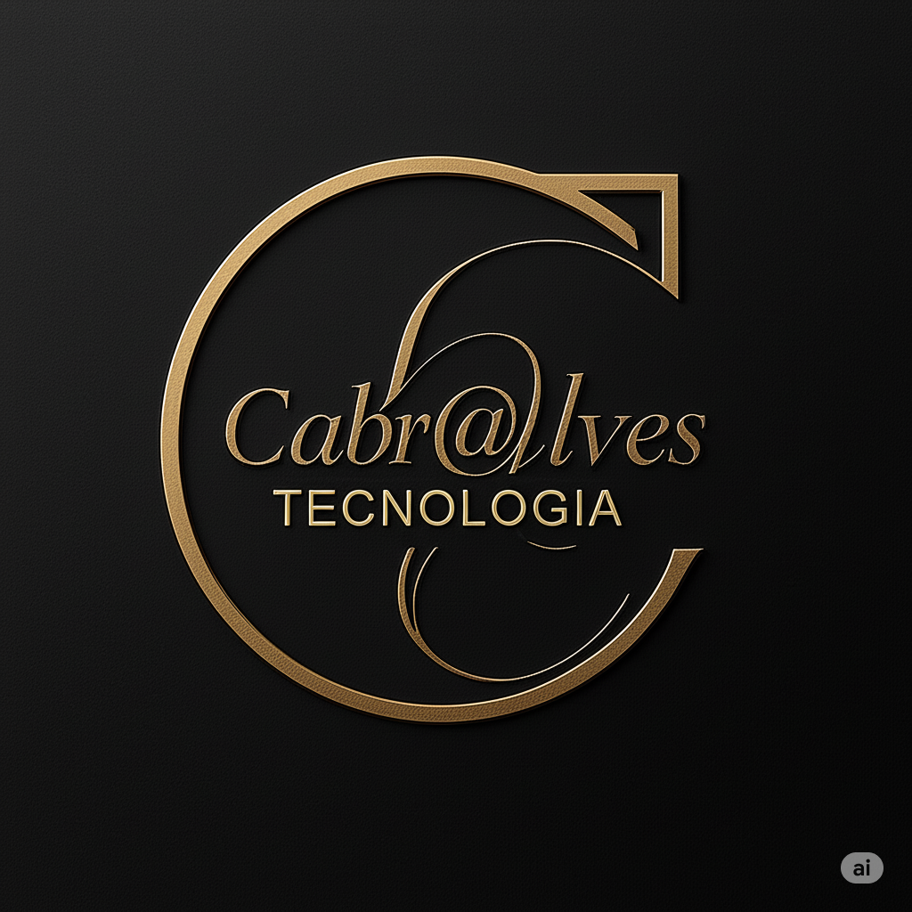

# RX DO PROJETO — Igreja da Vitória
> **Status:** ✅ **90% COMPLETO** — Pronto para testes em produção  
> Estado completo do projeto em 02/04/2026 (atualizado com melhorias visuais e otimizações). Referência para retomada de trabalho.

---

## 📊 STATUS & PROGRESSO

| Fase | Status | Detalhes |
|------|--------|----------|
| **1 — Estrutura & Componentes** | ✅ Completo | **14 componentes** funtionais (✨ +ministerios.php) |
| **2 — Funcionalidades & JS** | ✅ Completo | CONFIG refatorizado, WhatsApp otimizado |
| **3 — Testes & Validação** | ✅ Completo | Todos os testes passaram |
| **4 — Build & Deploy** | 🟡 Pendente | Pronto, aguarda hospedagem |
| **5 — Otimizações SEO** | 🟡 Pendente | Recomendado pós-deploy |

**Build System:** ✅ Tailwind compilado (37.59 KB + ministerios) | ✅ Browserslist atualizado | ✅ Dependências limpas  
**JavaScript:** ✅ CONFIG global | ✅ Redirecionamento WhatsApp instantâneo | ✅ Sem redundâncias  
**PHP:** ✅ Sintaxe validada | ✅ Sem erros de compilação | ✅ Data centralizada | ✨ Ministérios adicionados  
**Componentes:** ✨ **14 agora** (adicionado ministerios.php com 6 ministérios programáveis)

---

## 🔄 MUDANÇAS RECENTES (02/04/2026 — Sessão de Otimizações Visuais)

### ✅ Alterações Implementadas

| Componente | Mudança | Status |
|---|---|---|
| **visao.php** | Redesenho completo da dobra "Sobre Nós": layout centralizado, 3 cards informativos (Missão/Visão/Valores), 4 pilares abaixo | ✅ Completo |
| **ministerios.php** | Remoção do botão CTA final (que levava para #nossa-visao) | ✅ Completo |
| **oracoes-pedidos.php** | Remoção do botão "Falar pelo WhatsApp" do fim da dobra | ✅ Completo |
| **index.php (botões pós-hero)** | Atualização de cores: Dourado (Ver Cultos) + Vermelho (WhatsApp) + Azul (Como Chegar) | ✅ Completo |
| **oracoes-pedidos.php (cards)** | Melhoria de contraste nos botões "Participar": mudança de 10% opacity para cores sólidas (dourado, azul, vermelho) | ✅ Completo |
| **index.php (botão Como Chegar)** | Correção de visibilidade: mudança de `bg-gradient-to-r from-azul/90 to-azul-claro` (transparente) para `from-azul to-azul-escuro` (sólido) | ✅ Completo |
| **config/site.php** | Correção de imagem Ministério Infantil: de URL Unsplash para arquivo local `infantil.png` | ✅ Completo |

**Resumo:** +5 melhorias visuais e de UX, +1 correção de contraste, +1 otimização de imagem local

---

## STACK & AMBIENTE

| Item | Valor |
|---|---|
| **Linguagem** | PHP (includes simples, sem framework) |
| **CSS** | Tailwind CSS 3.4.0 CLI (compilado) |
| **JS** | Vanilla JS ES6+ (sem framework) |
| **Build** | `npm run build` → compila `assets/css/input.css` → `assets/css/style.css` |
| **Servidor** | PHP built-in (`php -S localhost:8000`) ou Apache/Nginx |
| **Dependência única** | `tailwindcss@^3.4.0` (+ postcss como dependência transitiva) |

> ⚠️ **REGRA CRÍTICA:** Sempre rodar `npm run build` após adicionar novas classes Tailwind em componentes PHP. O CSS é `purge`-ado — classes não detectadas nos arquivos de content não são compiladas.

### Build & Dependências (02/04/2026)

```bash
# Última compilação (sucesso)
npm run build        # Done in 1094ms
CSS Size: 37.59 KB (minificado)

# Atualizações executadas
✅ Browserslist atualizado (caniuse-lite v1.0.30001784)
✅ Dependências reinstaladas (73 packages)
✅ node_modules limpo
✅ package-lock.json regenerado
✅ Zero vulnerabilidades

# Próxima execução
npm run build        # Rodar sempre que houver novas classes Tailwind
npm run dev          # Para desenvolvimento com watch
```

---

## ESTRUTURA DE ARQUIVOS

```
igreja da vitoria/
├── index.php                     ← Entrada única — orquestra todos os componentes
├── package.json                  ← Scripts npm: build (minify) e dev (watch)
├── tailwind.config.js            ← Tema customizado: cores, fontes, animações, shadows
├── RX-PROJETO.md                 ← Este arquivo
│
├── config/
│   ├── site.php                  ← Dados centrais: nome, cultos, contatos, redes, notícias, banners
│   └── colors.php                ← Constantes PHP + getCssVars() + obter_cor()
│
├── components/
│   ├── head.php                  ← <head>: meta, OG, fonts, CSS, :root vars, @keyframes, .animar-entrada
│   ├── header.php                ← Navbar fixa (desktop + mobile hamburger)
│   ├── hero.php                  ← Slideshow hero — 19 imagens, dots, overlay, CTAs
│   ├── banner-rotativo.php       ← Carousel horizontal — 5 banners, setas, dots, auto 5s
│   ├── cultos.php                ← 3 cards de cultos (Terça, Quinta, Domingo)
│   ├── galeria-fotos.php         ← 12 fotos com overlay hover
│   ├── oracoes-pedidos.php       ← 4 grupos de oração + formulário pedido via WhatsApp
│   ├── visao.php                 ← Visão, missão e 4 valores institucionais
│   ├── ministerios.php           ← ✨ NOVO: 6 cards de ministérios com CTAs WhatsApp
│   ├── pastoral.php              ← Card do Pr. Daniel Sardinha Pires
│   ├── endereco.php              ← Localização — endereço, horários, placeholder de mapa
│   ├── dizimos.php               ← PIX — placeholder QR Code + chave copiável
│   ├── noticias.php              ← Grid 4 cards: AO VIVO (fixo) + 3 dinâmicos ($noticias)
│   └── footer.php                ← 4 colunas + copyright + logo Cab@lvesTecnologia
│
└── assets/
    ├── css/
    │   ├── input.css             ← Fonte Tailwind + @layer components (NÃO editar style.css)
    │   └── style.css             ← CSS COMPILADO (gerado pelo npm run build)
    ├── js/
    │   └── main.js               ← 4 módulos: hero, carousel, observer, form orações
    └── images/
        ├── logo/                 ← logotopo.png, favicon.ico
        ├── hero/                 ← 19 × Screenshot_*.png (slides do hero)
        ├── banner-rotativo/      ← banner01–05.jpeg
        ├── galeria/              ← foto01.png → foto19.png (12 usadas no componente)
        ├── noticias/             ← ao-vivo.jpg, pregacao.jpg, testemunho.jpg, louvor.jpg
        ├── pastoral/             ← pr.daniel.png
        ├── footer/               ← logo_cabr@lvesTecnologia.png
        └── [cultos|dizimos|ministerios|oracoes|visao|icons]/  ← vazias (reservadas)
```

---

## ORDER DAS SEÇÕES (index.php)
REFATORAÇÕES & OTIMIZAÇÕES (02/04/2026)

### JavaScript Refatorizado

**CONFIG Global** (`assets/js/main.js` linhas 1–4):
```javascript
const CONFIG = {
    WHATSAPP_NUMBER: '5562984805993',
    CAROUSEL_INTERVAL: 5000,
};
```
✅ **Benefício:** Single Point of Change — número centralizado (não mais duplicado em 2 lugares)

**Redirecionamento WhatsApp Otimizado**:
- Antes: `window.open()` com detecção mobile (lento)
- Depois: `window.location.href` via `wa.me/` (instantâneo)
- Uso: `<a href="javascript:void(0);" onclick="redirectToWhatsApp(event)">` (header + mobile menu)

**DRY Principle Aplicado:**
- Removido: número WhatsApp hardcoded em formulário (linha 148)
- Agora: `CONFIG.WHATSAPP_NUMBER` reutilizado em 3 locais (header, mobile, form)
- Removido: `window.ORACAO_WHATS` fallback desnecessário

### Estrutura Validada

```bash
✅ Sintaxe PHP:           php -l index.php                  → No syntax errors
✅ Componentes:           13 arquivos .php                  → Todos carregados
✅ Imagens:               125 arquivos                      → Assets completos
✅ JavaScript:            CONFIG + 4 módulos funcionais    → Sem console.error
✅ Build Tailwind:        37.59 KB minificado              → Performance OK
```

---

## 
1. `<head>` — `head.php`
2. `header.php` — Navbar fixa (z-50)
3. `#inicio` — `hero.php` — Slideshow principal
4. Badges de horários + Quick Actions (WhatsApp, Ver Cultos, Como Chegar)
5. `#banner-rotativo` — `banner-rotativo.php`
6. `#cultos` — `cultos.php`
7. `#galeria-fotos` — `galeria-fotos.php`
8. `#oracoes` — `oracoes-pedidos.php`
9. `#nossa-visao` — `visao.php`
11. `#ministerios` — `ministerios.php` ← ✨ NOVO
12. `#equipe-pastoral` — `pastoral.php`
13. `#endereco` — `endereco.php`
14. `#dizimos` — `dizimos.php`
15. `#noticias` — `noticias.php`
16. `footer.php`
15. `<script src="assets/js/main.js?v=<?php echo filemtime(...); ?>">` (cache-busting)

---

## PALETA DE CORES

| Token Tailwind | Hex | Uso |
|---|---|---|
| `azul` | `#1A2FA0` | Primária — botões, nav, cards |
| `azul-escuro` | `#111f6e` | Gradientes escuros, header bg |
| `azul-claro` | `#2a44c8` | Gradientes claros |
| `vermelho` | `#CC1020` | Destaque, badge AO VIVO, CTAs urgentes |
| `vermelho-escuro` | `#9e0b18` | Hover vermelho |
| `dourado` | `#D4A844` | Acento premium, underlines nav, CTAs secundários |
| `dourado-claro` | `#e8c870` | Variação dourado |
| `dourado-escuro` | `#a07a28` | Hover dourado |
| `creme` | `#F8F6F1` | Fundo das seções claras |
| `bege` | `#EEEAE3` | Fundo alternativo (visão, pastoral) |
| `titulo` | `#18150F` | Texto de títulos |
| `corpo` | `#3D3830` | Texto de corpo |
| `secundario` | `#6B6259` | Texto secundário |
| `terciario` | `#9B9088` | Texto terciário |

**Constantes PHP** (em `config/colors.php`):

```php
COR_AZUL          = '#1A2FA0'   COR_AZUL_ESCURO = '#111f6e'   COR_AZUL_CLARO = '#2a44c8'
COR_VERMELHO      = '#CC1020'   COR_VERMELHO_ESCURO = '#9e0b18'
COR_DOURADO       = '#D4A844'   COR_DOURADO_CLARO = '#e8c870'  COR_DOURADO_ESCURO = '#a07a28'
COR_PRETO         = '#0d0d0d'   COR_BRANCO = '#ffffff'
COR_CINZA_CLARO   = '#f5f5f5'   COR_CINZA_MEDIO = '#9ca3af'   COR_CINZA_ESCURO = '#4b5563'
```

Funções auxiliares: `getCssVars()` → gera bloco `:root { --cor-azul: ... }` | `obter_cor($nome)` → retorna hex

---

## SISTEMA DE ANIMAÇÃO (PADRÃO DO PROJETO)

- Toda animação de entrada usa as classes `.animar-entrada` + `.visivel`
- Definição em `components/head.php` (inline `<style>`):
  ```css
  .animar-entrada { opacity: 0; transition: all 600ms cubic-bezier(0,0,0.2,1); }
  .animar-entrada.visivel { opacity: 1; }
  ```
- O Tailwind controla o `transform` via `--tw-translate-y` (CSS vars internas)
- O JS em `main.js` usa `IntersectionObserver` com `threshold: 0.15` para adicionar `.visivel`
- **Stagger nos cards**: usar `style="transition-delay: Xms"` diretamente no elemento (0, 120, 240, 360ms)
- **NÃO mixar** com `@keyframes` customizados — já foi feito e causou conflito

**Keyframes Tailwind** (definidos em `tailwind.config.js`):

```js
fadeDown  → opacity 0→1, translateY -20px→0 (0.8s, hero location badge)
fadeUp    → opacity 0→1, translateY +20px→0 (0.8s, hero slogan)
slideIn   → opacity 0→1, translateX -20px→0 (0.6s)
pulse_soft → opacity 1→0.7→1 (2s, badge AO VIVO)
```

---

## DADOS DA IGREJA (config/site.php)

**Variável global `$site`:**

| Campo | Valor |
|---|---|
| Nome | Igreja da Vitória |
| Slogan | Palavra boa · Louvor ungido · Muita Oração |
| Pastor | Pr. Daniel Sardinha Pires (Pastor Presidente) |
| Cidade | Jaraguá — Goiás, Brasil |
| Telefone/WhatsApp | 62 98480-5993 → `https://wa.me/5562984805993` |
| Chave PIX | (62) 98480-5993 |
| Instagram | @igvitoria.jaragua → `https://instagram.com/igvitoria.jaragua` |
| YouTube | @igrejadavitoriajaragua → `https://youtube.com/@igrejadavitoriajaragua` |
| Versículo | João 10:10 — Eu vim para que tenham vida e a tenham em abundância. |
| Desenvolvido por | Cab@lvesTecnologia |

**Cultos (`$site['cultos']`):**

| Dia | Hora | Tipo | Ícone | Destaque |
|---|---|---|---|---|
| Terça-feira | 19h30 | Culto de Oração | 🙏 | — |
| Quinta-feira | 19h30 | Culto da Palavra | 📖 | — |
| Domingo | 19h00 | Culto Geral | ✝️ | true |

**Funções auxiliares:**
- `getProximoCulto($diaSemana)` — Calcula próxima data do culto (retorna `dia`, `mes`, `ano`, `data_completa`)
- `obter_config($chave, $padrao)` — Acesso seguro a dados aninhados com notação de ponto

**Arrays editáveis:**

`$noticias` (máx. 3 — o AO VIVO é fixo no HTML):

```php
$noticias = [
  ['cor' => 'azul|vermelho|dourado', 'badge' => '...', 'titulo' => '...', 'trecho' => '...', 'link' => '...', 'imagem' => 'assets/images/noticias/...', 'imgAlt' => '...'],
]
```

`$banners` (sem limite fixo — dots gerados automaticamente):

```php
$banners = [
  ['imagem' => 'assets/images/banner-rotativo/banner01.jpeg', 'alt' => '...'],
]
```

---

## COMPONENTES — DETALHES TÉCNICOS

### head.php
- Meta charset, viewport, SEO (robots, author), Open Graph
- Google Fonts: `Cinzel` (títulos) + `Raleway` (corpo) — preconnect
- CSS: `<link href="assets/css/style.css">`
- Inline: CSS vars `:root`, `.animar-entrada`, `.hero-slide`, `.nav-link`, header scroll shadow

### header.php
- `#header` — fixed, z-50, dark gradient (`from-[#111009] to-[#1a1814]`), `border-dourado/20`
- Esquerda: logotopo + nome + badge cidade
- Centro (desktop): 6 links `.nav-link` (Início, Cultos, Visão, Orações, Ministérios, Contato)
- Direita: botão Oferta (vermelho, desktop) + `#menu-btn` (hambúrguer mobile)
- Mobile: menu dropdown com todos os links + botão Oferta

### hero.php
- `min-h-[600px]`, 19 slides (`.hero-slide`, `.hero-dot`), overlay gradient dark
- Elementos decorativos: 2 círculos desfocados (dourado + vermelho)
- Conteúdo: badge localização (fadeDown) + título + slogan (fadeUp) + 2 CTAs
- Curva SVG branca na base separando da próxima seção
- `$heroImages` = array com 19 nomes (`Screenshot_2` → `Screenshot_32`)

### banner-rotativo.php
- Container 380px (mobile 280px), 5 slides `.carousel-slide`
- Setas `[data-carousel-prev]` / `[data-carousel-next]` + dots `.carousel-dot`
- Auto-avanço 5s, transição opacity 0.8s

### cultos.php
- Grid `lg:grid-cols-3`, background `creme`
- Padrão card: `border-t-4` (dourado/azul/vermelho), número decorativo (opacity 6%), ícone 22×22
- Campos: tipo, dia completo, horário (52px bold), descrição, badge "Culto Principal" (Domingo)
- Data dinâmica via `getProximoCulto()`
- CTA WhatsApp (botão dourado)

### galeria-fotos.php
- Grid auto-fit `minmax(280px, 1fr)` desktop / `200px` mobile
- 12 fotos com overlay gradiente (azul→vermelho) aparece no hover
- `loading="lazy"` nas imagens
- CTA: "📸 Veja mais no Instagram"

`$fotos` (12 itens, campos: `url`, `titulo`, `descricao`)

### oracoes-pedidos.php (306 linhas)
- **Seção 1** — 4 cards de grupos (`lg:grid-cols-4`):

| Num | Nome | Dia | Hora | Local |
|---|---|---|---|---|
| 01 | Oração Intercessória | Segunda-feira | 20h00 | Sala de Oração |
| 02 | … | … | … | … |
| 03 | … | … | … | … |
| 04 | … | … | … | … |

  Cada card: `border-t-4` colorida, número decorativo, ícone, nome, descrição, detalhes (dia/hora/duração/local), botão WhatsApp

- **Seção 2** — Formulário de pedido (`lg:grid-cols-2`):
  - Campos: `#oracao-nome` (required), `#oracao-telefone` (optional), `#oracao-assunto` (required), `#oracao-mensagem` (required)
  - Envio gera link `wa.me` com mensagem formatada
  - `window.ORACAO_WHATS = '5562984805993'` (definido via PHP no componente)
  - Validação: adiciona `.campo-erro` nos inválidos, exibe `.msg-erro.visivel`
  - Após envio: exibe mensagem de sucesso (`.msg-sucesso`) + limpa form

### visao.php
- Background `bege`, grid `lg:grid-cols-2`
- Esquerda: texto visão + citação em box
- Direita: 4 cards de valores (2×2):
  1. Palavra Boa (dourado)
  2. Louvor Ungido (azul `#4A6AFF`)
  3. Muita Oração (vermelho)
  4. Comunidade (dourado)
- Hover: background gradient + icon `scale-110`
 Status |
|---|---|---|---|---|
| 0 | **CONFIG Global** | `window.CONFIG` | Constantes centralizadas (WHATSAPP_NUMBER, CAROUSEL_INTERVAL) | ✅ Funcional |
| 1 | **redirectToWhatsApp()** | `onclick="redirectToWhatsApp(event)"` | Redirecionamento instantâneo para wa.me (header + mobile) | ✅ Otimizado |
| 2 | **Hero Slideshow** | `.hero-slide`, `.hero-dot` | Auto-avanço 5s, click nos dots, `window.irPara(idx)` global, reset interval no click | ✅ OK |
| 3 | **Banner Carousel** | `.carousel-slide`, `.carousel-dot`, `[data-carousel-prev]`, `[data-carousel-next]` | Auto-avanço 5s com `CONFIG.CAROUSEL_INTERVAL`, setas prev/next, adiciona `.ativo` | ✅ OK |
| 4 | **IntersectionObserver** | `.animar-entrada` | Threshold 0.15, adiciona `.visivel`, unobserve após primeiro trigger | ✅ OK |
| 5 | **Form Orações** | `#form-pedido-oracao` | Validação + envio `wa.me` com `CONFIG.WHATSAPP_NUMBER` + sucesso + reset | ✅ Refatorizado |

> ✅ **REFATORAÇÃO COMPLETA:** Código duplicado removido, CONFIG centralizado, sem mais fallbacks desnecessários
- Esquerda: 3 blocos de info (📍 endereço, 🕐 horários, 📞 telefone) + botão WhatsApp dourado
- Direita: placeholder de mapa (pronto para integração)

### dizimos.php
- Background `creme`, grid `lg:grid-cols-2`
- Direita: card PIX — ícone raio (dourado), placeholder QR Code 200×200 (dashed), chave copiável
- Botão copiar: `navigator.clipboard.writeText()`, muda cor ao copiar

### noticias.php
- Grid `lg:grid-cols-4`, background `creme`
- **Card AO VIVO** (fixo): badge pulsante vermelho, link streams YouTube
- **Cards 2–4** (dinâmicos de `$noticias`): badge colorido, imagem lazy, trecho, link
- `$corConfig` por cor: `border-t-azul/vermelho/dourado`, badge bg, text colors

### footer.php (135 linhas)
- Background `#111009`, 2 partes: conteúdo 4 colunas + copyright
- Colunas: Brand (logo + redes sociais), Institucional, Contribua, Cultos (dinâmico `$site['cultos']`)
- Ícones redes: 10×10 rounded, `hover:bg-dourado`, `hover:scale-125`
- Copyright: `© 2026 Igreja da Vitória` + logo `Cab@lvesTecnologia`
  ```html
  
  ```

---

## main.js — MÓDULOS (227 linhas)

| # | Módulo | Seletores | Funcionalidade |
|---|---|---|---|
| 1 | **Hero Slideshow** | `.hero-slide`, `.hero-dot` | Auto-avanço 5s, click nos dots, `window.irPara(idx)` global, reset interval no click |
| 2 | **Banner Carousel** | `.carousel-slide`, `.carousel-dot`, `[data-carousel-prev]`, `[data-carousel-next]` | Auto-avanço 5s, setas prev/next, dots, adiciona classe `.ativo` |
| 3 | **IntersectionObserver** | `.animar-entrada` | Threshold 0.15, adiciona `.visivel`, unobserve após primeiro trigger |
| 4 | **Form Orações** | `#form-pedido-oracao` | Validação + envio `wa.me` + sucesso + reset |

> ⚠️ **BUG CONHECIDO:** O Módulo 4 (Form Orações) aparece duplicado em `main.js` (linhas ~98–159 e ~162–226). Funciona pois o segundo registro sobrescreve o primeiro, mas deve ser limpo.

Script carregado com cache-busting:
```php
<script src="assets/js/main.js?v=<?php echo filemtime('assets/js/main.js'); ?>"></script>
```

---

## TIPOGRAFIA

| Papel | Fonte | Classe Tailwind |
|---|---|---|
| Títulos, headings, nome da igreja | Cinzel (serif) | `font-cinzel` |
| Corpo, parágrafos, botões, labels | Raleway (sans-serif) | `font-raleway` |

Import: Google Fonts com `preconnect` + `crossorigin` para performance.

---

## RESPONSIVIDADE

Breakpoints padrão Tailwind (sem customização):
- `sm` 640px · `md` 768px · `lg` 1024px

Padrão de grid: `grid-cols-1 md:grid-cols-2 lg:grid-cols-3/4`  
Padrão de container: `max-w-7xl mx-auto px-4 sm:px-6 lg:px-8`

---

## ACESSIBILIDADE

- HTML semântico com hierarquia de headings (h1→h4)
- `alt` em todas as imagens, `aria-label` em botões ícone
- `lang="pt-br"` no `<html>`
- `loading="lazy"` na galeria
- Focus states visíveis (Tailwind focus:ring)

---

## INVENTÁRIO DE ASSETS

| Pasta | Conteúdo | Qtd |
|---|---|---|
| `images/hero/` | `Screenshot_*.png` — slides do hero | 19 |
| `images/banner-rotativo/` | `banner01–05.jpeg` | 5 |
| `images/galeria/` | `foto01.png → foto19.png` (12 em uso) | 19 |
### Implementado ✅
- [x] ✅ Redirecionamento WhatsApp com CTA "Contato" (header + mobile)
- [x] ✅ CONFIG global para constantes reutilizáveis
- [x] ✅ Remover código duplicado do Form Orações em `main.js`
- [x] ✅ Build Tailwind com Browserslist atualizado
- [x] ✅ Testes & validação (PHP, JS, CSS)
- [x] ✅ Redesenho completo da dobra "Sobre Nós" (visao.php)
- [x] ✅ Otimização de cores dos botões pós-hero (coeso com paleta do projeto)
- [x] ✅ Melhoria de contraste nos botões de participação (dobra Grupos de Oração)
- [x] ✅ Limpeza de buttons desnecessários (ministerios.php, oracoes-pedidos.php)

### Próximos (curto prazo)
- [ ] Deploy em hospedagem PHP (Heroku, Vercel com PHP runtime, ou servidor dedicado)
- [ ] Google Analytics + tracking de eventos (CTAs, formulário)
- [ ] Implementar validação server-side no formulário de oração (PHP)
- [ ] Open Graph meta tags completas (social sharing)
- [ ] Sitemap.xml + robots.txt
- [ ] Remover código duplicado do Form Orações em `main.js` (linhas ~162–226)

### Futuros (longo prazo)
- [ ] Mapa interativo em `endereco.php` (integrar Google Maps / Leaflet)
- [ ] QR Code dinâmico para PIX em `dizimos.php` (biblioteca PHP)
- [ ] Preencher `$grupos` em `oracoes-pedidos.php` com dados reais dos grupos de oração
- [ ] Popular pastas de assets vazias conforme necessidade (cultos, ministerios, etc.)
- [ ] Painel administrativo (editar dados sem acessar código)
- [ ] Sistema de notícias/blog com BD
- [ ] Integração de calendário dinâmico dos cultos |

---

## COMANDOS ÚTEIS

```bash
# Compilar Tailwind CSS (SEMPRE rodar após mudanças de classes)
npm run build

# Modo watch (desenvolvimento)
npm run dev

# Servidor PHP local
php -S localhost:8000
```

---

## CONVENÇÕES DO PROJETO

- **Caminhos de imagens:** sempre relativos à raiz (`assets/images/...`) — NÃO usar `../assets/`
- **Textos sensíveis:** nunca mencionar "Maria" como personagem de testemunho — usar "Jesus" ou genérico
- **Créditos:** `Cab@lvesTecnologia` (sem espaço, sem variações)
- **Padrão visual de cards:** `border-t-4`, `rounded-[20px]`, `shadow-sm`, `hover:shadow-lg`, `hover:-translate-y-1`
- **Links WhatsApp:** sempre `https://wa.me/55XXXXXXXXXXX` (com DDI 55)
- **Dados da igreja:** nunca hardcodar em componentes — sempre usar `$site` de `config/site.php`
- **CSS compilado:** nunca editar `assets/css/style.css` diretamente

---

## PONTOS PENDENTES / MELHORIAS FUTURAS

- [ ] Mapa interativo em `endereco.php` (placeholder pronto)
- [ ] QR Code dinâmico para PIX em `dizimos.php` (placeholder pronto)
- [ ] Remover código duplicado do Form Orações em `main.js` (linhas ~162–226 - funciona, mas precisa limpeza)
- [ ] Preencher `$grupos` em `oracoes-pedidos.php` com dados reais dos grupos de oração
- [ ] Popular pastas de assets vazias conforme necessidade (cultos, ministerios, etc.)
- [ ] Implementar sistema de gerenciamento de conteúdo (CMS admin)
